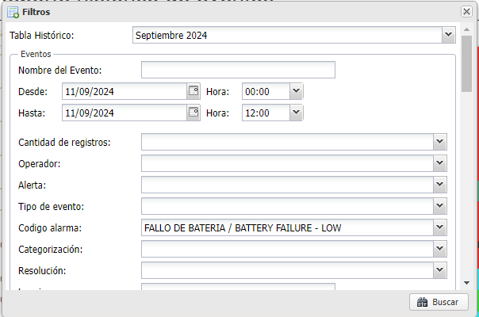

# RobotCenselMichael

Este repositorio tiene el codigo del robot encargado de automatizar el proceso de ingreso a la pagina de Censel y descargar los reportes web de baterias, intrusion, fallo de test y panico y guardarlos en la base de datos.

# Configuracion 

1. Clonar el repositorio.
2. Instalar las dependencias usando 'pip install -r requirements.txt'.  pip freeze > "requirements.txt" (Puede que falten algunas).
3. Crear el bot de telegram 

## Como crear el bot de telegram

1. Descargar Telegram desktop
2. Buscar el bot llamado "BotFather" este bot nos guiará paso a paso para crear nuestro bot (Debemos asegurarnos de hacer el proceso con el Bot verificado)
3. Este bot nos dará el token de el bot que acabamos de crear, est token debemos guardarlo en la variabe llamada TELEGRAM_BOT_TOKEN
4. luego debemos obtener nuestro chat id, este lo obtenemos con el bot Get My ID, este automaticamente nos dara el id que necesitamos y lo debemos guardarla en la variable TELEGRAM_CHAT_ID.

Con estos cambios ya deberiamos tener nuestro bot parametrizado para que nos lleguen todos los mensajes, a continuacion dejare una imagen de los chats de los bots que tenemos que buscar, para asegurarnos de no hacer el proceso en el bot que no debemos.




# Funciones
```
def iniciar_sesion():

```
* Esta es la funcion que se llama para inciar todo el proceso, por medio de atajos de teclado con la libreria pyautogui abre el navegador, escribe la url de la pagina de censel, busca el campo de email usando otra funcion, escribe el correo y la contraseña y da enter para ingresar a la pagina.

Podemos observar que esta es la unica funcion que llamamos al final de nuestro codigo ya que dentro de esta llamamos las demas funciones que continuan el proceso, esto se podria mejorar para que cada funcion sea mas independiente y mas escalable.

```
def iniciar_filtro(img, tupla=None):

```
* Esta funcion es de las mas importantes, ya que siempre la usamos dentro de un bucle for para que recorra las diferentes tuplas que tenemos al inicio del codigo: 

```
tupla_inicar_sesion = (
            'cancelar_chrome.png',
            'eliminar_sesion.png',
            'email.png',
            'abandonar.png',
            'email.png',
            )

tupla_filtro = (
            'logo_censel.png',
            'logo_reportes_web.png',
            'eventos.png', 
            'reporte_eventos_por_fecha.png',
            'filtros.png',) 

tupla_postformulario = (    
            'exportar.png',
            'exportar_a_csv.png',)

```

* En ciertas ocasiones al ingresar a la pagina ya se encuentra una sesion iniciada, ademas el navegador siempre nos muestra ciertos mensajes en pantalla. La tupla inciar_sesion contiene las imagenes para hacer todas estas validaciones e iniciar sesion. la segunda tupla tiene las imagenes de los iconos dentro de la pagina de censel para que el mouse de click, ingresando al apartado que necesitamos para descargar los reportes. La ultima tupla como su nombre lo indica, es para cuando ya llenamos los campos que necesitamos para descargar el reporte dependiendo del horario, solo tiene las imagenes de los botones para descargar el archivo excel.


* Dentro de la funcion iniciar_filtro se llaman las demas finciones para el tratamiento de imagenes. A continuacion se explicara el proceso que realiza con cada imagen de la tupla.

´´´
def obtener_ruta_imagenes(nombre_imagen):

´´´

* Esta funcion recibe por parametro el nombre de la imagen que obtenemos de la tupla por medio del bucle for, con el nombre de la imagen lo que hace es buscarla y nos retorna la ruta, en nuestra funcion iniciar_filtro guardamos la ruta de la imagen en la variable ruta_imagen.

Ya con la ruta de la imagen obtenida llamamos a la siguiente funcion:

```

def obtener_coordenadas_imagen_pantalla(nombre_imagen):

```

* Esta funcion usa el metodo locateOnScreen de la libreria pyautogui para encontrar en la pantalla la imagen que le estamos pasando y las cordenadas las guarda en una variable y las retorna, en caso contrario retorna None. 

Como podemos ver en la declaracion de esta funcion le pasamos como parametro una variable llamada nombre_imagen, en realidad esta variable es la ruta de la imagen ya que en la funcion iniciar_filtro le pasamos el parametro de la siguiente manera: 

```
coordenadas_imagen = obtener_coordenadas_imagen_pantalla(ruta_imagen)

```

* Ya con las cordenadas de la imagen la funcion iniciar_filtro mueve el cursor a dichas coordenadas y despues de da click, en este punto hace una validacion ya que hay una de las imagenes a las que se necesita dar doble click en la pagina

despues toma una captura de pantalla, para esto usa la siguiente funcion:

```
def obtener_captura_pantalla(nombre_captura, carpeta):

```

* Esta funcion recibe por parametro el nombre de la imagen como se encuentra en la tupla y el nombre de la carpeta donde se va a guardar dicha captura, en todos los casos este parametro guarda el pantallazo en la carpeta 'screenshots'.

Internamente le cambia el nombre a la imagen y le agrega la palabra "_pantallazo" antes de la extension despues toma la captura con el metodo .screenshot de pyautogui y retorma la ruta de dicha captura que acaba de hacer. Esto se guarda en una variable y volvemos a usar la funcion obtener_ruta_imagenes().

Con la ruta de la captura usamos la funcion de enviar el mensaje al telegram.

```
def msm_telegram (mensaje, ruta_imagen=None):

```
* Esta funcion recibe la cadena de texto que queremos enviar al telegram como parametro y si vamos a enviar una imagen recibe su ruta, las imagenes que vamos a enviar siempre son los pantallazos.

* La funcion iniciar_filtro al final tiene una validacion para reiniciar el proceso cuando no encuentra una imagen: 

```
if tupla != 'iniciar_sesion':
                    ruta_captura = obtener_captura_pantalla(img, 'screenshots')
                    ruta_captura = obtener_ruta_imagenes(ruta_captura)
                    msm_telegram(f'No se encontro la imagen: {img} en la pantalla. \nSe cierra el navegador y se inicia el proceso nuevamente.', ruta_captura)
                    os.system("taskkill /f /im chrome.exe")
                    time.sleep(2)
                    iniciar_sesion()

```
* Cuando estamos ejecutando la tupla iniciar_sesion y no encuentra una imagen queremos que siga buscando las siguientes imagenes ya que el navegador puede mostrar un mensaje o no.

```
def recorrer_formulario_filtrar():

```

* Esta funcion se ejecuta ya cuando estamos en la ventana para filtrar que tipo de reporte queremos descargar aqui se recorre la ultima tupla que en realidad es una lista que almacena varias tuplas llamada horarios_procesos: 

```
horarios_procesos = [
    #nombre_proceso                 hora_ejecucion  hora_desde hora_hasta          codigo_alarma                    columnas_excel1    columnas_excel2      columnas_excel3         columnas_excel4    columnas_excel5     tabla                         
    ('baterias1',  fecha_ayer, fecha_hoy,   '7:00 PM', '12:00', '07:00', 'FALLO DE BATERIA / BATTERY FAILURE - LOW', 'cue_ncuenta', '',                  '',                    '',                    '',        'replica_registro_codigos_seguridad'),
    ('baterias2',  fecha_desde, fecha_hasta,'12:04 PM','00:00',  '12:00', 'FALLO DE BATERIA / BATTERY FAILURE - LOW', 'cue_ncuenta', '',                  '',                    '',                    '',        'replica_registro_codigos_seguridad'),
    ('intrusion',  fecha_ayer,  fecha_hoy,  '10:56 AM', '19:00', '07:00', 'INTRUSION - BUR',                          'cue_ncuenta', 'rec_czona',         'rec_tFechaProceso',   'rec_tFechaRecepcion', '_puerto', 'replica_seg_control_novedades'),
    ('fallo_test', fecha_ayer,  fecha_hoy,  '8:42 AM', '19:00', '07:00', 'FALLO DE TEST / TEST FAIL - FTS',          'cue_ncuenta', 'rec_tFechaProceso', 'rec_tFechaRecepcion', 'tablaDatos',          '',        'replica_seg_control_novedades'),
    ('panico',     fecha_ayer,  fecha_ayer, '8:48 AM', '00:00', '23:50', 'PANICO SILENCIOSO / PANIC SILENCE - DUR',  'cue_ncuenta', 'rec_czona',         'rec_tFechaProceso',   'rec_tFechaRecepcion', '_puerto', 'replica_seg_control_novedades')]

```

* Esta lista contiene las tuplas con toda la informacion que necesitamos con la siguente estructura: primero el nombre del proceso para identificarlo y usarlo al insertar en la base de datos. despues tenemos dos variables de fechas que seran ingresadas en el filtro, cada proceso maneja su propio rango de fechas, luego tenemos el campo de la hora a la que se va a ejecutar el proceso, si queremos hacer pruebas con un proceso en especifico tenemos que cambiar este campo a la hora actual o podemos cambiar el String por la variable hora_actual. En los dos siguientes campos tenemos el rango de horas en que se va a descargar el proceso, luego en el filtro hay un campo llamado: codigo alarma, este campo es el mas importante ya que es el que filtra el tipo de reporte que descargamos. Como se puede ver en la tupla cada proceso tiene su codigo de alarma que se va a escribir en el campo. Luego de llenar el formulario ejecutamos la funcion iniciar_filtro otra vez para dar click en los siguientes botones para descargar el archivo excel generado.

* Dentro de la funcion recorrer_formulario_filtrar se hace la validacion de la hora_ejecucion con hora_actual para ejecutar el proceso que correspondiente, cuando se llena el formulario y se descarga el archivo se usa la ultima funcion para ingresar la informacion del excel a la base de datos.

```

def procesar_archivo_excel(descargas_path='~/Downloads', tabla=None, nombre_proceso=None, col1=None, col2=None, col3=None, col4=None, col5=None):

```

* En esta funcion iniciamos conectandonos a la base de datos con la funcion que tenemos en config.py y se busca en la carpeta de descargas del pc el ultimo archivo excel descargado y lo lee en segundo plano. Luego dependiendo del proceso que estemos ejecutando guarda los datos de las columnas del excel, estas se encuentran en la lista. Por eso es importanto horarios_procesos[] ya que con validar el horario ya tenemos toda la informacion para el resto de la ejecucion.

* Los procesos baterias1 y baterias2 son el mismo pero se ejecuta en horarios diferentes, este solo consulta una columna en el excel y es el unico proceso que necesita eliminar los valores duplicados que traiga el excel, para esto pasamos la lista que contiene todos los valores a un set() ya que este no permite valores duplicados, por lo que los elimina.

despues recorremos con un for y guardamos los datos en un output.write para despues usar copy_from para hacer una insercion masiva de datos a la base de datos ya que por lo general son mas de 300 valores. Este proceso tambien se hace con los demas procesos, al final de la funcion se cierra la conexion a la base de datos, se elimina el archivo excel y se notifica por telegram cuanto duro la ejecucion del proceso.